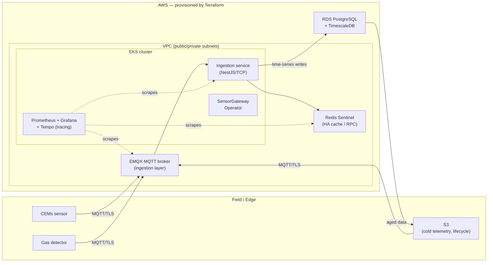

# Industrial IoT Platform on AWS
[](https://github.com/thefuriousowl/iot-platform-aws/actions/workflows/ci.yaml)
[](LICENSE)

> A production-shaped, fully reproducible Industrial IoT platform: ingest safety-critical
> sensor telemetry (emissions, gas detection, water quality), store it as time-series,
> alert on it in sub-second, and deploy the whole thing from an empty AWS account with
> `terraform apply` + GitOps.

This repo is a portfolio project. It is built to be **read in 30 seconds and run in a few minutes**.
The architecture mirrors a real greenfield Industrial IoT platform, but every piece here is
reproducible, version-controlled, and documented.

---

## ⚡ Quick Demo (30 seconds, no setup)

**Option 1: Static dashboard** — just open in browser:
```bash
open apps/web-dashboard/demo/index.html
```

**Option 2: Docker** — run the Angular dashboard:
```bash
docker run -p 8080:8080 ghcr.io/thefuriousowl/iot-web-dashboard:latest
# Open http://localhost:8080
```

> These demos show the operations dashboard UI. For full data flow with live telemetry,
> see [Local Development](#local-development-no-aws-required) below.

---


## 👋 Hiring? Start with the layer that matches the role

| If you're hiring for…   | Read this                                                                 | What it shows |
|-------------------------|---------------------------------------------------------------------------|---------------|
| **Cloud Engineer / Solutions Architect** | [`infra/terraform/`](infra/terraform) + [docs/cloud-architecture.md](docs/cloud-architecture.md) | VPC design (public/private subnets, NAT), EKS, RDS, S3 lifecycle, IAM least-privilege + IRSA, cost design, multi-env |
| **Platform / DevOps Engineer** | [`platform/`](platform) + [docs/platform.md](docs/platform.md) | GitOps (ArgoCD), Helm packaging, CI/CD, a Kubernetes Operator, zero-downtime deploys |
| **SRE / Reliability**   | [`observability/`](observability) + [docs/reliability.md](docs/reliability.md) | SLOs as code, Prometheus alert rules, runbooks for safety-critical scenarios |

---

## Architecture



Full diagram and design rationale: [docs/architecture.md](docs/architecture.md)
Detailed system architecture (topology, data flow, security layers, failure domains, scaling): [docs/system-architecture.md](docs/system-architecture.md)

---

## Quick start

```bash
# 0. Prerequisites: AWS account, terraform >= 1.7, kubectl, helm, just (or make)

# 1. Provision the cloud layer (dev environment)
cd infra/terraform/envs/dev
terraform init
terraform apply          # VPC, EKS, RDS, S3, IAM

# 2. Bootstrap GitOps — ArgoCD then takes over and syncs everything
kubectl apply -k platform/argocd/bootstrap

# 3. Watch the platform converge
argocd app list

# 4. Run the sensor simulator locally to push telemetry
cd apps/sensor-simulator
python sim.py --profile gas-detection --rate 5

# 5. See the operator dashboard instantly (no build) — open in a browser:
#    apps/web-dashboard/demo/index.html
```

> **Cost note:** the `dev` environment is designed to run cheaply (single small node group,
> spot instances, `db.t4g.micro`). Tear down with `terraform destroy`. See
> [docs/cost.md](docs/cost.md) for the estimate and the k3s-vs-EKS trade-off.

---

## Local Development (No AWS Required)

Run the entire platform locally with Docker Compose:

```bash
# 1. Start infrastructure (MQTT, Redis, TimescaleDB, Prometheus, Grafana)
docker compose up -d

# 2. Start ingestion service
cd apps/ingestion-service
pnpm install && pnpm prisma migrate dev && pnpm start:dev

# 3. Start sensor simulator
cd apps/sensor-simulator
python sim.py --profile gas-detection --rate 1

# 4. View dashboards
open http://localhost:3001  # Grafana (admin/admin)
open http://localhost:9090  # Prometheus

```
What you'll see:

- Real-time telemetry flowing through MQTT → NestJS → TimescaleDB
- Prometheus metrics at :3000/metrics
- Grafana dashboard with message rates and alerts
- Alert rules firing on thresholds


---

## Design decisions (the important part)

This project is deliberately opinionated. Each major choice is documented with the
*trade-off*, not just the result — because platform and cloud work is judged on judgment.

- **k3s for early-stage → EKS for scale.** [docs/cost.md](docs/cost.md)
- **Redis Sentinel over a single Redis.** Eliminates the single point of failure for
  HA caching and cross-service RPC coordination. [docs/platform.md](docs/platform.md)
- **MQTT/EMQX as a decoupling layer.** Edge collection survives core-service restarts.
- **TimescaleDB on RDS PostgreSQL.** Managed Postgres + time-series, no self-hosted DB ops.
- **IRSA for pod-level IAM.** No long-lived keys in the cluster. [docs/cloud-architecture.md](docs/cloud-architecture.md)

---

## Repo layout

infra/terraform/      # Cloud layer — VPC, EKS, RDS, S3, IAM (modules + dev/prod envs)
platform/             # Platform layer — ArgoCD, Helm charts, Kubernetes operator
apps/                 # Sensor simulator + ingestion service + Angular web dashboard
observability/        # SLOs, alert rules, Grafana dashboards, runbooks
docs/                 # Architecture + per-role deep dives
.github/workflows/    # CI: terraform plan, lint, Infracost, image build
```

---

## Status / roadmap

- [x] Cloud layer Terraform modules (network, eks, data, iam)
- [x] GitOps bootstrap with ArgoCD
- [x] Sensor simulator (gas / CEMs / water profiles)
- [x] SensorGateway operator scaffold
- [x] Angular operations dashboard (+ standalone demo)
- [x] SLO + alert rules + runbooks
- [x] Distributed tracing wired end-to-end (OpenTelemetry → Tempo)
- [x] NestJS ingestion service (MQTT, Redis dedup, TimescaleDB, alerts)
- [x] Prometheus + Grafana observability stack
- [x] REST API for historical queries
- [x] WebSocket streaming for live data
- [x] SensorGateway Kubernetes operator (Kubebuilder, Go)
- [x] Infracost gate in CI
- [x] Chaos test: kill Redis primary, assert failover < 10s

---

*Built by Unnop Paripunnang — AWS Certified Solutions Architect, CKA. Background in
safety-critical Industrial IoT (CEMs, gas detection, water/energy monitoring).*
