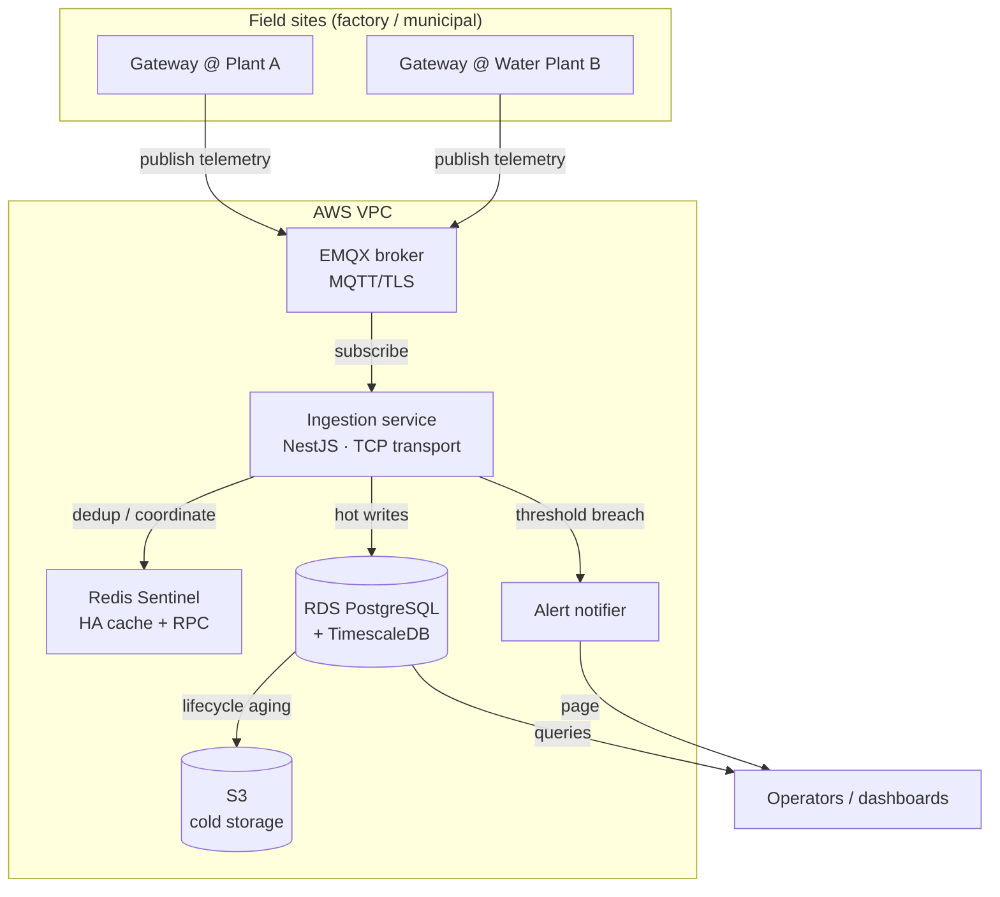
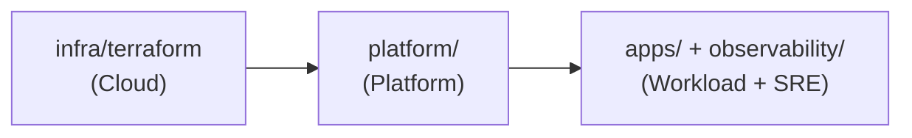

# Architecture

## End-to-end data flow

## Why these components

| Component        | Choice                | Alternative considered | Why this one |
|------------------|-----------------------|------------------------|--------------|
| Ingestion bus    | EMQX (MQTT)           | Kafka                  | MQTT is the native protocol for constrained field devices; lighter to operate at this scale |
| Inter-service    | NestJS TCP transport  | HTTP REST everywhere   | Lower overhead for internal RPC; REST kept for external/client APIs |
| HA cache / coord | Redis Sentinel        | Single Redis           | Removes single point of failure; automatic primary failover |
| Time-series DB   | TimescaleDB on RDS    | Self-hosted Influx     | Managed Postgres ops + SQL + time-series; no DB babysitting |
| Cold storage     | S3 + lifecycle        | Keep all in DB         | DB stays small/fast; old telemetry archived cheaply |
| Orchestration    | EKS (k3s early-stage) | ECS / plain VMs        | Kubernetes-native, portable, autoscaling |

## Failure domains

Every service runs as an independent deployment with its own probes and disruption budget.
A restart or crash of one (say the alert notifier) does not stop ingestion or the broker.
This is the "services fail independently" principle from the field: in a factory, a partial
outage that keeps gas monitoring alive is acceptable; a full outage is not.

## Layered repo → layered responsibility

Terraform creates the ground (VPC/EKS/RDS/S3/IAM). ArgoCD + Helm install the platform onto
it. The apps and observability run on the platform. Each layer is independently reviewable.
