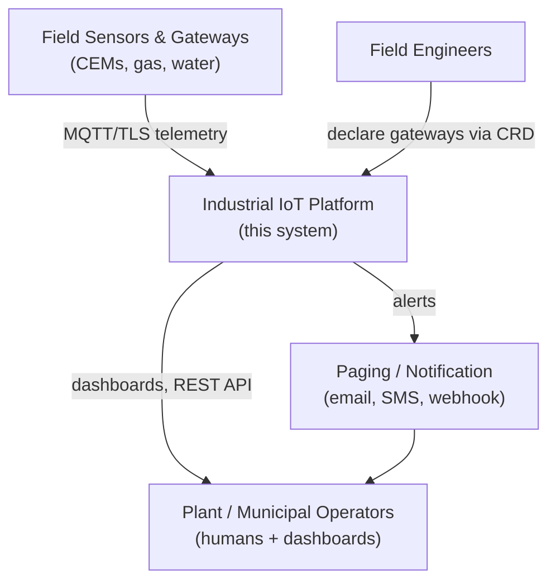
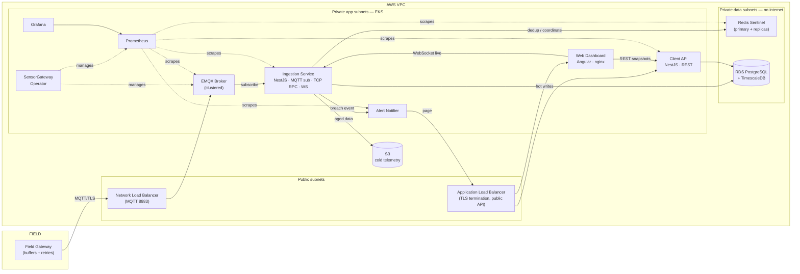
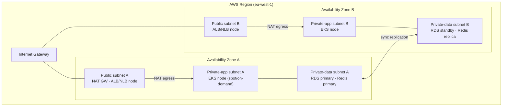
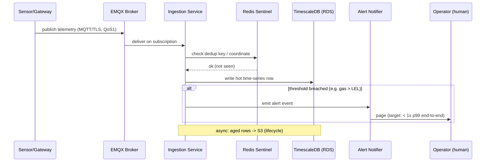
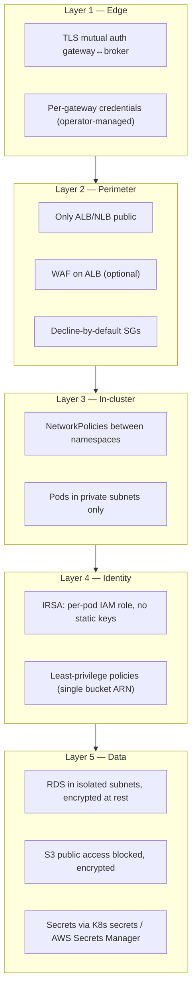
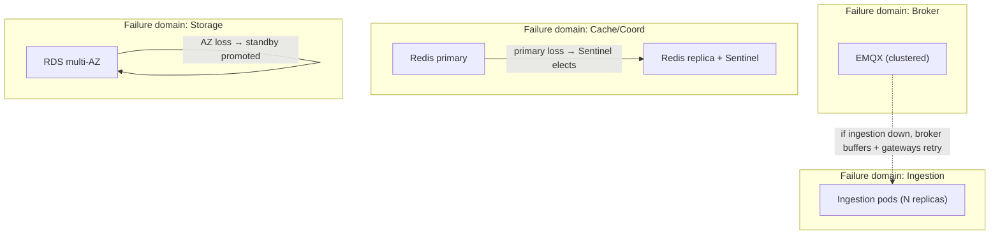
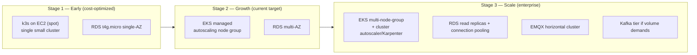

# System Architecture — Industrial IoT Platform on AWS

> Detailed architecture for the `iot-platform-aws` platform: how telemetry travels from a
> sensor in the field to an operator's pager, what runs where, how it's secured, how it fails
> safely, and how it scales from a single cheap cluster to a multi-AZ production system.

**Audience:** reviewers evaluating Cloud / Platform / SA depth. Read alongside
[`docs/architecture.md`](architecture.md) (overview), [`docs/cloud-architecture.md`](cloud-architecture.md)
(AWS detail) and [`docs/platform.md`](platform.md) (platform detail).

---

## 1. Context — what the system does

The platform ingests, stores, monitors, and alerts on **safety-critical industrial
telemetry** from distributed field sites:

- **CEMs** — Continuous Emissions Monitoring (NOx, SO₂, CO, O₂, stack flow)
- **Gas detection** — combustible/toxic gas ppm with leak alarms
- **Water quality / energy** — pH, turbidity, dissolved O₂, conductivity

The hard requirement that shapes everything: **an alert must arrive fast and must not be
lost.** A late gas-leak alert is a safety incident, not a missed SLA.

### System context (C4 level 1)

---

## 2. Container view (C4 level 2) — the runtime pieces

### Responsibilities

| Container | Responsibility | Tech | Why |
|-----------|----------------|------|-----|
| Field Gateway | Collect from sensors, buffer, publish | Edge device | Survives WAN outage with local buffering |
| EMQX Broker | MQTT ingestion front door | EMQX (clustered) | Native IoT protocol; decouples edge from core |
| Ingestion Service | Validate, dedup, persist, evaluate thresholds | NestJS | Core logic; your stack |
| Client API | Serve dashboards & external queries | NestJS REST | Separate read path from ingestion |
| Web Dashboard | Operator control-room UI (live status, alerts, SLOs) | Angular + nginx | At-a-glance ops view; complements Grafana |
| Alert Notifier | Fan-out alerts to channels | NestJS | Isolated failure domain for paging |
| SensorGateway Operator | Reconcile per-gateway config | Go / kubebuilder | Declarative gateway onboarding |
| Redis Sentinel | HA cache + RPC coordination | Redis + Sentinel | Removes single point of failure |
| RDS + TimescaleDB | Time-series hot store | Managed Postgres | Managed ops + SQL + time-series |
| S3 | Cold telemetry archive | S3 + lifecycle | Cheap long-term retention |
| Prometheus/Grafana | Metrics, SLO, dashboards | kube-prometheus-stack | Observability from day one |

---

## 3. Deployment topology — what runs where on AWS

### Subnet design rationale

| Tier | Internet route | Holds | Why this isolation |
|------|----------------|-------|--------------------|
| Public | IGW (in + out) | NAT, ALB, NLB | Only the load balancers face the internet |
| Private-app | NAT (egress only) | EKS workers, all pods | Pods reach AWS APIs / pull images, but aren't reachable inbound |
| Private-data | **none** | RDS, Redis | Databases are unreachable from the internet by routing, not just SG |

Security groups are **SG-to-SG**, e.g. "DB-SG accepts 5432 only from app-node-SG" — rules
read as intent, not opaque CIDR ranges.

---

## 4. End-to-end data flow (the critical path)

**Latency budget for a gas-leak alert (SLO p99 < 1s):**

| Hop | Budget | Notes |
|-----|--------|-------|
| Gateway → EMQX | ~150 ms | WAN dependent; QoS1 ensures delivery |
| EMQX → Ingestion | ~50 ms | in-cluster |
| Dedup/threshold eval | ~50 ms | Redis + in-memory check |
| Ingestion → Notifier → page | ~200 ms | in-cluster + provider |
| **Headroom** | ~550 ms | absorbs jitter, GC, failover blips |

The `alert_latency_seconds` metric measures this end-to-end and drives the `GasAlertLatencyHigh` SLO.

### Two separated paths

- **Write/alert path:** Gateway → EMQX → Ingestion → (Redis, TimescaleDB, Notifier). Optimized
  for low latency and no loss.
- **Read path:** Operators/dashboards → ALB → Client API → TimescaleDB. Separated so heavy
  dashboard queries never slow ingestion.
- **Live UI path:** Web Dashboard (Angular) pulls REST snapshots from the Client API and
  subscribes to a WebSocket stream from the ingestion service for real-time readings/alerts —
  the same separation of bulk-read vs live-push applied at the UI layer.

---

## 5. Network & security layers

**Defense in depth highlights:**
- No long-lived AWS keys anywhere in the cluster — **IRSA** binds each workload's K8s service
  account to a scoped IAM role via the cluster OIDC provider.
- The database is protected by **routing** (no internet route) *and* **SG-to-SG** rules *and*
  **encryption at rest** — three independent layers.
- Field gateways authenticate per-device; a compromised single gateway credential can be
  revoked by the operator without redeploying anything.

---

## 6. Failure domains & resilience

The design principle from the field: **services fail independently** — a partial outage that
keeps gas monitoring alive is acceptable; a cascading full outage is not.

| Failure | Blast radius | Mitigation | Recovery |
|---------|-------------|------------|----------|
| One ingestion pod dies | None | N replicas + PDB | K8s reschedules |
| EMQX node dies | None | Clustered broker | Cluster rebalances |
| Redis primary dies | Brief RPC blip | Sentinel quorum | Auto-failover, clients rediscover |
| AZ failure | Degraded, not down | 2 AZs, RDS multi-AZ | Standby promoted |
| Field WAN outage | That site only | Gateway buffers | Backfills on reconnect |
| Bad deploy | Caught early | Rolling update + probes + ArgoCD | `git revert` rollback |

**Key resilience properties:**
- **Decoupling via EMQX** means a full ingestion restart doesn't drop telemetry — the broker
  holds and gateways retry (QoS1).
- **Redis Sentinel** removes the single point of failure for caching/coordination.
- **GitOps** makes rollback a `git revert`, with full audit trail.

---

## 7. Scaling path — early-stage → enterprise

Because every stage runs **standard Kubernetes**, the platform layer (Helm charts, ArgoCD
apps, the operator) is **portable across all three** — migration is an infrastructure
concern, not an application rewrite. That portability is the whole reason for choosing k3s
first instead of a proprietary early-stage shortcut.

### What changes vs what stays at each stage

| Concern | Stage 1 | Stage 2 | Stage 3 |
|---------|---------|---------|---------|
| Compute | k3s/EC2 spot | EKS managed | EKS + Karpenter |
| DB | single-AZ micro | multi-AZ | read replicas + pooling |
| Broker | single EMQX | clustered EMQX | horizontal EMQX (+ Kafka?) |
| Ingestion | few replicas | HPA | HPA + partitioned consumers |
| **Manifests/charts** | **identical** | **identical** | **identical** |

---

## 8. Technology choices summary

| Decision | Chosen | Alternative | Rationale (full ADR in `docs/decisions/`) |
|----------|--------|-------------|---------|
| Orchestration | EKS (k3s early) | ECS / VMs | K8s-native, portable, autoscaling |
| Ingestion bus | EMQX (MQTT) | Kafka | Native device protocol; lighter at this scale |
| Inter-service | NestJS TCP RPC | HTTP everywhere | Lower internal overhead; REST kept for clients |
| HA cache/coord | Redis Sentinel | Single Redis | Removes SPOF; auto-failover |
| Time-series DB | TimescaleDB on RDS | Self-hosted Influx | Managed ops + SQL |
| Cold storage | S3 + lifecycle | All-in-DB | DB stays fast; cheap archive |
| Identity | IRSA | Static keys/node IAM | No long-lived creds; least privilege |
| Delivery | GitOps (ArgoCD) | Push from CI | Git as source of truth; easy rollback |
| Gateway onboarding | K8s Operator | Templated manifests | Declarative; extends the API |

---

## 9. Cross-cutting concerns

**Observability:** Prometheus scrapes every service; SLOs are recording/alerting rules; Grafana
dashboards are committed as JSON. Roadmap: OpenTelemetry distributed tracing broker → ingestion
→ DB → notifier into Tempo, so a slow alert is traceable across hops.

**Configuration & secrets:** Non-secret config via Helm values + ConfigMaps (in Git). Secrets
via Kubernetes Secrets sourced from AWS Secrets Manager / Terraform outputs — never committed.

**CI/CD:** PRs run `terraform validate`/`fmt`, Helm lint, image build/scan, Infracost diff.
Merge to `main` updates image tags; ArgoCD reconciles. Build (CI) and deploy (GitOps) are
separated.

**Data lifecycle:** Hot data in TimescaleDB hypertables (chunked by time); aged data
transitions to S3 Standard-IA (30d) → Glacier (90d) → expiry per retention policy.

**Multi-tenancy / multi-site:** Telemetry is namespaced by `site/gateway` in MQTT topics and
as columns/tags in TimescaleDB, so one platform serves many factory/municipal clients with
per-site dashboards and alerts.

---

## 10. Open items / roadmap (honest scope)

- [ ] Distributed tracing wired end-to-end (OpenTelemetry → Tempo).
- [ ] Infracost gate enforced (not just informational) in CI.
- [ ] Chaos test: kill Redis primary, assert failover < 10s and alert latency within SLO.
- [ ] NetworkPolicies fully enforced between namespaces.
- [ ] Karpenter evaluation for Stage 3 node provisioning.
- [ ] DR runbook: cross-region backup restore drill.

---

*This document describes the intended architecture of the portfolio project. Items in §10 are
not yet implemented — see [`PROJECT_PLAN.md`](../PROJECT_PLAN.md) for the build sequence.*
